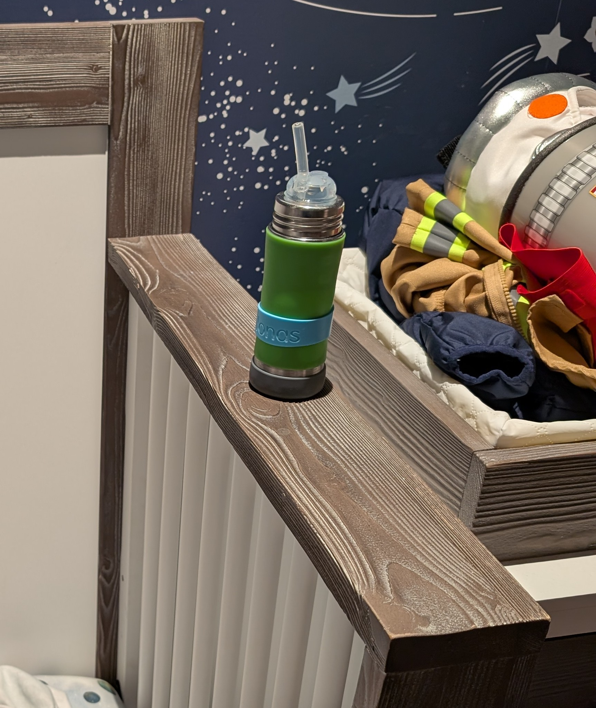
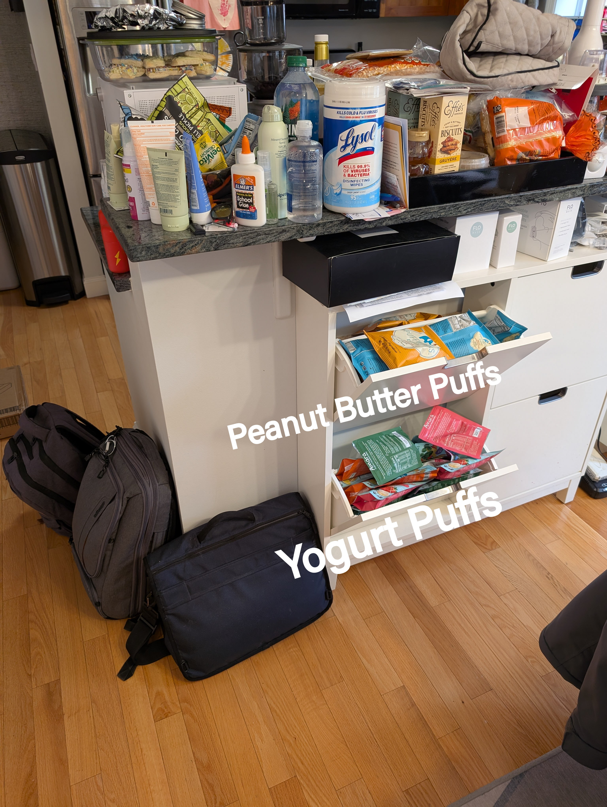
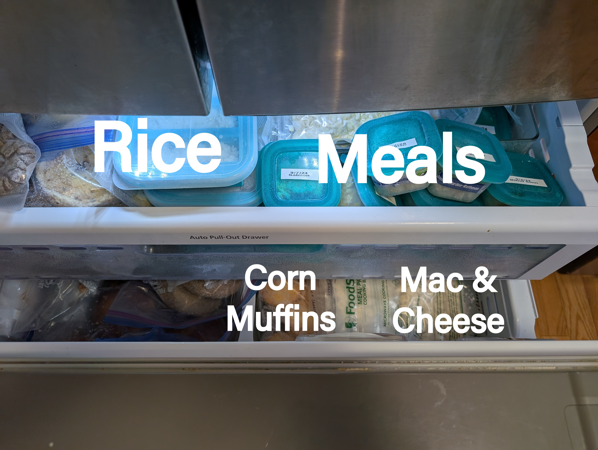

# Where to find things

## Diapers
Dresser next to the crib, top drawer in the middle.

## Underwear
Dresser next to the crib, top drawer in the middle.

## Clothes
Dresser next to the crib, middle drawer.

## Pajamas
Dresser next to the crib, middle drawer.

## Shoes
His normal red shoes are under the shoe bench. Snow/rain boots are inside the bench.

## Coats
Above the shoe bench.

## Backpack
Above the shoe bench.

## Mask
In the diaper bag backpack. The small middle zipper.

## Vitamins
1 per day.

Yellow & red bottle to the left of the sink.

## Iron
2 per day.

Red bottle next to the espresso machine.

## Bottles
Upper cabinet to the right of the sink, bottom shelf.

## Sleep Sack
Usually lives in the crib. Take it out and leave it on his small chair during naps.

## Medicine
Guest bath vanity, top right drawer. It has a magnet lock. The magnet is stuck on the wall next to the medicine cabinet.

Or the medicine cabinet in the guest bath.

## Band-aids
Master bath vanity, bottom left drawer.

## Toothbrush
Master bath vanity, right of the sink. His toothbrush is the blue one. The head is the one with the frozen characters
in the case next to the other brush.

## Crib Bottle

## Prepared Foods

### Pantry

### Puffs

### Freezer

